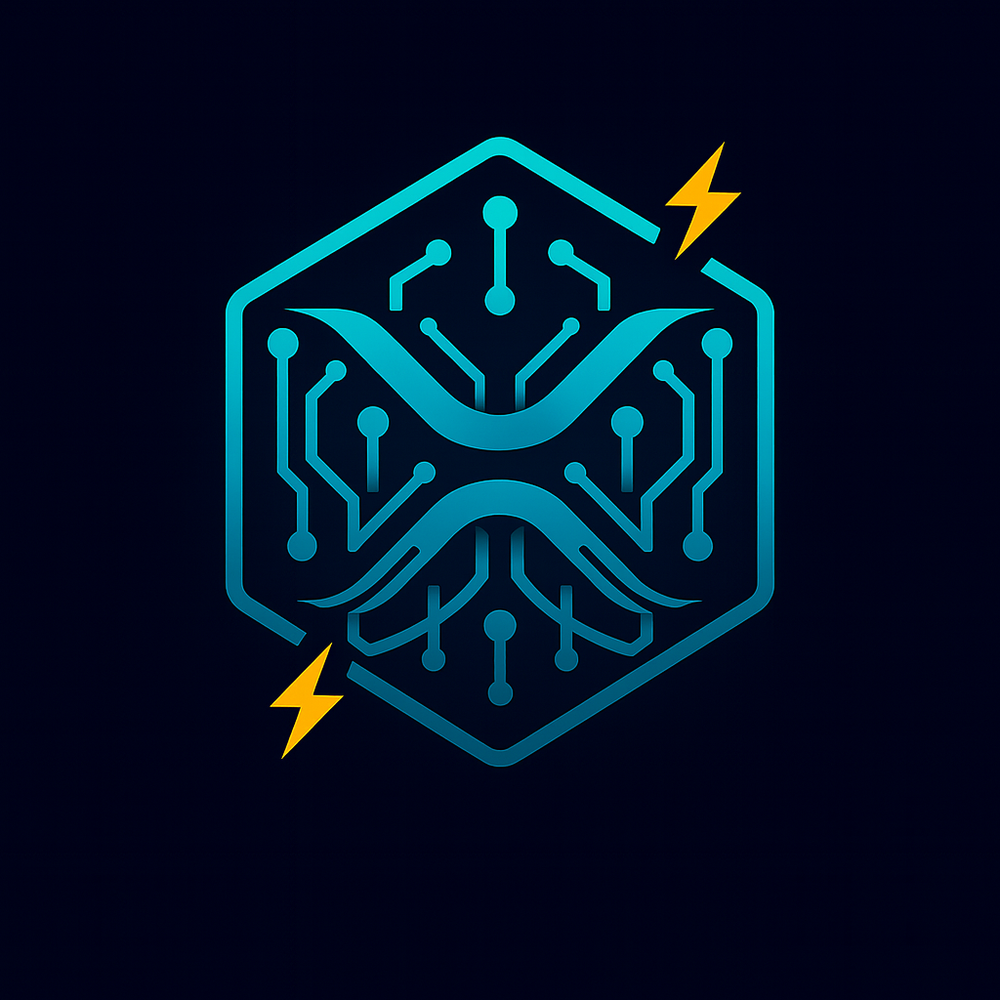

<div align="center">
  
</div>

# Ripple

[](https://ziglang.org/)
[](https://ziglang.org/)
[](https://webassembly.org/)
[](https://github.com/)

Reactive, WASM-first web UI framework for Zig. Bringing Leptos/Yew-style ergonomics with Zig's comptime power, zero C dependencies, and exceptional developer experience.

## ✨ Features

- 🚀 **WASM-First**: Built from the ground up for WebAssembly
- ⚡ **Reactive**: Fine-grained reactivity with signals and effects
- 🔧 **Zero C Dependencies**: Pure Zig implementation
- 🎯 **Leptos/Yew Inspired**: Familiar ergonomics for web developers
- 🛠️ **Comptime Powered**: Leverage Zig's compile-time capabilities
- 🏝️ **Islands Architecture**: Server-side rendering with selective hydration

## 🎯 Goals

- Full WebAssembly support with optimal performance
- Leptos/Yew-style reactivity and component model
- Exceptional developer experience with hot module reloading
- Server-side rendering with islands architecture
- Zero runtime dependencies beyond the browser

## 🚧 Status

Ripple is currently in early development. This is a ground-up implementation of a reactive web framework targeting WebAssembly through Zig.

## 📋 Roadmap

- **Core Runtime**: Signals, effects, and reactive scheduler
- **DOM & Rendering**: Template compiler and hydration system
- **Routing**: File-based and programmatic routing
- **Forms & Validation**: Progressive enhancement with schema validation
- **Components**: Headless, accessible component primitives
- **Styling**: Design tokens and theming system
- **Tooling**: Development server with HMR and build pipeline

## 🛠️ Installation

Add Ripple to your Zig project:

```bash
zig fetch --save https://github.com/ghostkellz/ripple/archive/refs/head/main.tar.gz
```

## 🛠️ Building

```bash
zig build
```

## 📄 License

Licensed under the [MIT License](LICENSE).
